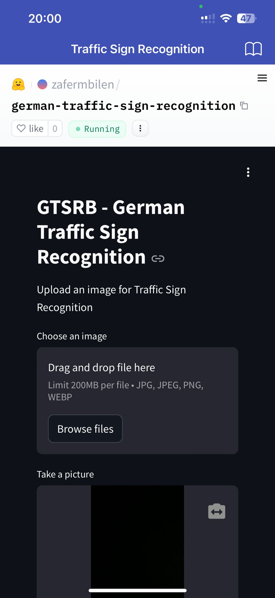
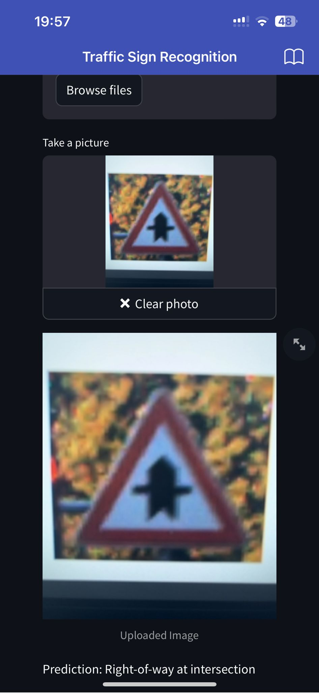
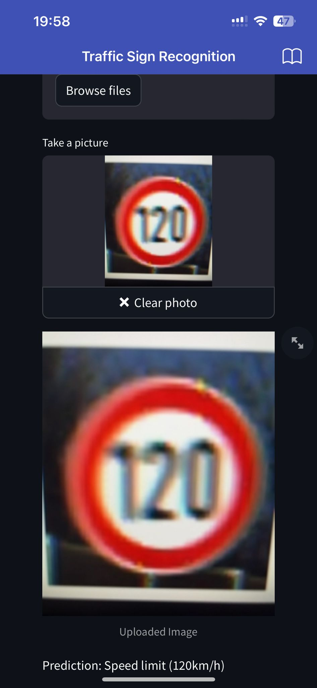

# Traffic Sign Recognition

## Screenshots







## Overview

This repository contains a deep learning model for traffic sign recognition. The model is trained on the German Traffic Sign Recognition Benchmark (GTSRB) dataset and deployed as a web application using Streamlit. Additionally, a mobile app has been developed using MIT App Inventor to allow the model to be used on mobile devices.

## Dataset

The model is trained using the [GTSRB - German Traffic Sign Recognition Benchmark](https://www.kaggle.com/datasets/meowmeowmeowmeowmeow/gtsrb-german-traffic-sign) dataset. This dataset includes a wide variety of traffic signs with corresponding labels.

## Model Training

The model utilizes deep learning techniques to classify traffic signs based on their labels. The training process involved preprocessing the dataset, building and training a convolutional neural network (CNN), and evaluating its performance.

## Deployment

### Web Application

The trained model is deployed as a web application using Streamlit. The app is hosted on Hugging Face Spaces, providing an interactive interface for users to upload images of traffic signs and receive predictions.

### Mobile Application

A mobile app was developed using [MIT App Inventor](http://appinventor.mit.edu/). This app allows users to leverage the traffic sign recognition model on their mobile devices. The app integrates with the model to provide real-time predictions.

## Usage

### Web App

1. Visit the Hugging Face Space: [Link to Web App]
2. Upload an image of a traffic sign.
3. View the predicted label.

### Mobile App

1. Download and install the app from [App Inventor](http://appinventor.mit.edu/).
2. Open the app on your mobile device.
3. Capture or upload an image of a traffic sign.
4. Receive and view the prediction on your mobile screen.

## Installation

To run the code locally:

1. Clone the repository:

   ```bash
   git clone https://github.com/yourusername/traffic-sign-recognition.git

   ```

2. Install the required dependencies:

   ```bash
   pip install -r requirements.txt

   ```

3. Run the Streamlit app:
   ```bash
   streamlit run app.py
   ```

## Acknowledgments

- [GTSRB - German Traffic Sign Recognition Benchmark](https://www.kaggle.com/datasets/meowmeowmeowmeowmeow/gtsrb-german-traffic-sign)

- [Streamlit](https://streamlit.io/)

- [Hugging Face Spaces](https://huggingface.co/spaces/zafermbilen/german-traffic-sign-recognition)

- [MIT App Inventor](http://appinventor.mit.edu/)
